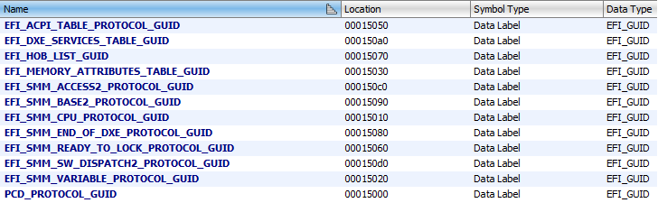
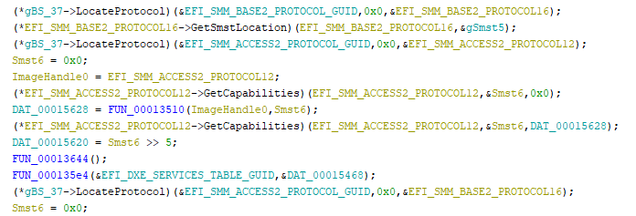
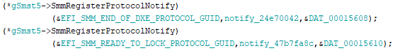
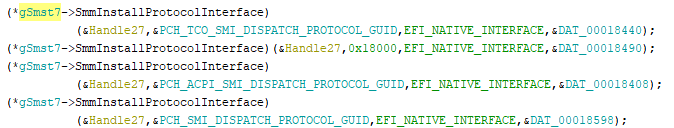
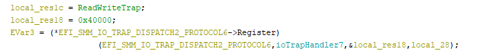
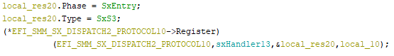
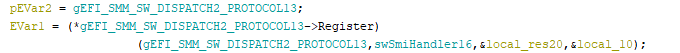
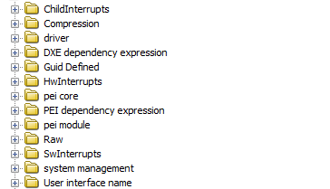

# ***efiSeek for Ghidra***

## About

The analyzer automates the process of exploring EFI files. After the analysis, well-known protocols, interrupts, etc. are found.

## Features

### Find known EFI GUID's

### Identified protocols which are finding with `LOCATE_PROTOCOL` function

### Identified functions used as the `NOTIFY` function

### Identified protocols installed in the module through `INSTALL_PROTOCOL_INTERFACE`

### Identified functions used as an interrupt function (like some hardware, software or child interrupt)

### Script for loading efi modules to relevant directories upon import in `Headless mode`

Sorting smm modules relying on meta information by next folders:

* SwInterrupts
* ChildInterrupts
* HwInterrupts
* UnknownInterrupts

## Installation

Set the `GHIDRA_INSTALL_DIR` environment variable to the ghidra path.

Start `gradlew.bat`, after the completion of building a copy archive from the `dist` directory to `GHIDRA_HOME_DIR/Extensions/Ghidra/`.
And turn on this extention in your ghidra.

## Usage

After install, you can use the analyzer. If you open a UEFI file, the analyzer appears and is selected automatically.
To start the analyzer, press `A` or `Analysis/Auto Analyze` and press `Analyze`.

## References

* https://github.com/al3xtjames/ghidra-firmware-utils
* https://github.com/danse-macabre/ida-efitools/